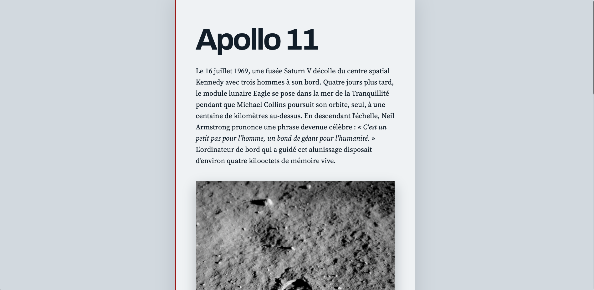
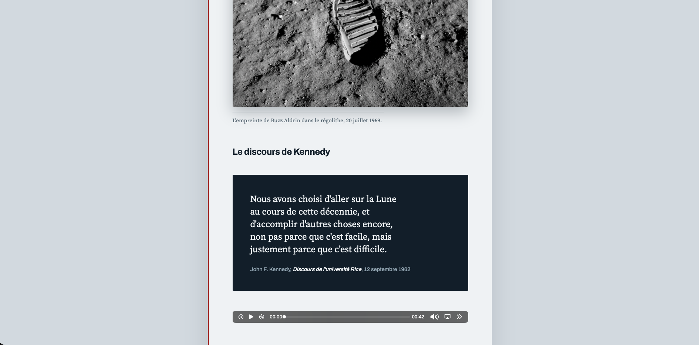
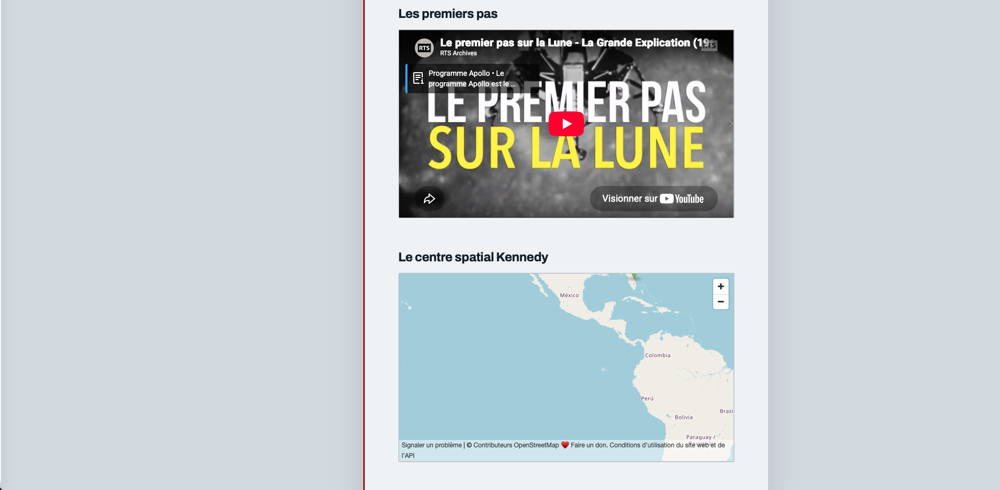

# Apollo 11 🚀

Le 20 juillet 1969, deux humains posent le pied sur la Lune pendant qu'un troisième tourne en orbite au-dessus d'eux. L'ordinateur de bord du module lunaire disposait de moins de mémoire qu'une simple calculatrice d'aujourd'hui.

Le but de cet exercice est de produire une page Web présentant la mission Apollo 11, en mettant l'accent sur les balises de citation.

[Dossier de départ :material-download:](./apollo11.zip){ .md-button .md-button--primary }

## Résultat attendu

{data-zoom-image}
{data-zoom-image}
{data-zoom-image}

## Consignes

- [ ] Télécharger le [dossier de départ](apollo_depart.zip)
- [ ] Dans `<body>`, ajouter un `<main>`. Tout le contenu du site y sera contenu.
- [ ] Dans `<main>`, ajouter un titre 1 avec le contenu : « Apollo 11 »
- [ ] Dans `<main>`, ajouter une `<section>`.

### Dans `<section>` :

- [ ] Ajouter un paragraphe de présentation décrivant la mission. 
!!! tip 

    Le 16 juillet 1969, une fusée Saturn V décolle du centre spatial Kennedy avec trois hommes à son bord. Quatre jours plus tard, le module lunaire Eagle se pose dans la mer de la Tranquillité pendant que Michael Collins poursuit son orbite, seul, à une centaine de kilomètres au-dessus. En descendant l'échelle, Neil Armstrong prononce une phrase devenue célèbre : C'est un petit pas pour l'homme, un bond de géant pour l'humanité. L'ordinateur de bord qui a guidé cet alunissage disposait d'environ quatre kilooctets de mémoire vive.
- [ ] Dans ce paragraphe, insérer une courte citation de Neil Armstrong à l'aide de la balise `<q>`.
- [ ] Ajouter une `<figure>` contenant l'image `bottes.jpg` et une `<figcaption>`.
- [ ] Ajouter un titre 2 avec le contenu : « Le discours de Kennedy »
- [ ] Ajouter un `<blockquote>` contenant un extrait du discours de 1962 à l'université Rice. 
!!! tip

    Nous avons choisi d'aller sur la Lune au cours de cette décennie, et d'accomplir d'autres choses encore, non pas parce que c'est facile, mais justement parce que c'est difficile.

    John F. Kennedy, Discours de l'université Rice, 12 septembre 1962

- [ ] À l'intérieur du `<blockquote>`, ajouter un `<footer>` contenant une balise `<cite>` avec la source.
- [ ] Ajouter une balise `<audio>` utilisant des balises `<source>` pour les fichiers `apollo11.webm` et `apollo11.mp3`.
- [ ] Ajouter un titre 2 avec le contenu : « Les premiers pas »
- [ ] Ajouter le `<iframe>` de la vidéo ([source YouTube](https://www.youtube.com/watch?v=LQ0eGKnHUWE))
- [ ] ⚠️ L'iframe doit permettre le plein écran.
- [ ] Ajouter un titre 2 avec le contenu : « Le centre spatial Kennedy »
- [ ] Ajouter le `<iframe>` d'une carte [OpenStreetMap](https://www.openstreetmap.org/). Chercher pour « Kennedy Space Center ».