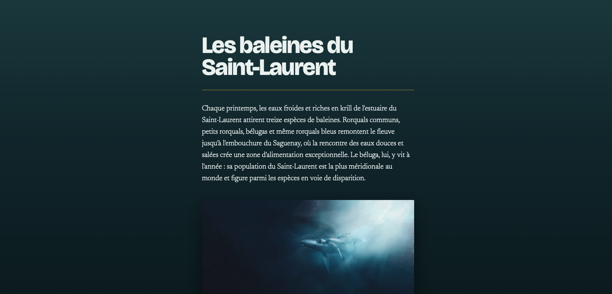
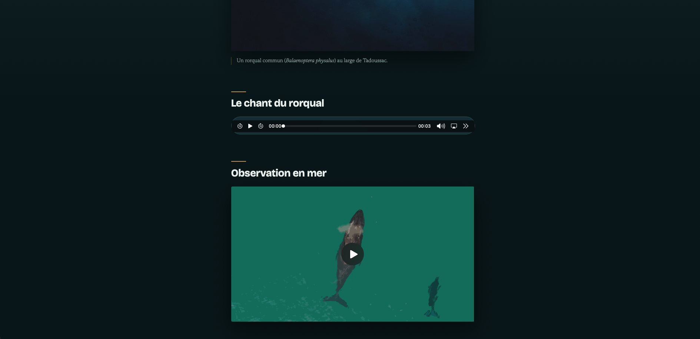
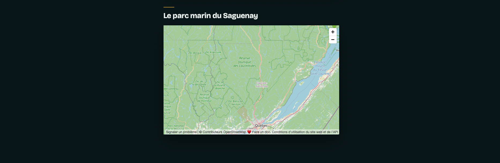

# Les baleines du Saint-Laurent 
Chaque été, treize espèces de baleines remontent le Saint-Laurent jusqu'à l'embouchure du Saguenay, attirées par les eaux froides et riches en krill. Le rorqual bleu, le plus gros animal ayant jamais vécu sur Terre, y fait partie des visiteurs réguliers.
Le but de cet exercice est de produire une page Web présentant les baleines du Saint-Laurent en intégrant différents types de médias.

[Dossier de départ :material-download:](./les-baleines.zip){ .md-button .md-button--primary }

## Résultat attendu
{data-zoom-image}
{data-zoom-image}
{data-zoom-image}

## Consignes

- [ ] Télécharger le dossier de départ
- [ ] Dans `<body>`, ajouter un `<main>`. Tout le contenu du site y sera contenu.
- [ ] Dans `<main>`, ajouter un titre 1 avec le contenu : « Les baleines du Saint-Laurent »
- [ ] Dans `<main>`, ajouter une `<section>`.

### Dans `<section>` :

- [ ] Ajouter un paragraphe de présentation décrivant la migration estivale. 
!!! Tip

    Chaque printemps, les eaux froides et riches en krill de l'estuaire du Saint-Laurent attirent treize espèces de baleines. Rorquals communs, petits rorquals, bélugas et même rorquals bleus remontent le fleuve jusqu'à l'embouchure du Saguenay, où la rencontre des eaux douces et salées crée une zone d'alimentation exceptionnelle. Le béluga, lui, y vit à l'année : sa population du Saint-Laurent est la plus méridionale au monde et figure parmi les espèces en voie de disparition.
- [ ] Ajouter une `<figure>` contenant l'image rorqual.jpg et une `<figcaption>` identifiant l'espèce.
- [ ] ⚠️ L'image doit avoir un alt pertinent.
- [ ] Ajouter un titre 2 avec le contenu : « Le chant du rorqual »
- [ ] Ajouter une balise `<audio>` utilisant des balises `<source>`pour les fichiers whale.webm et whale.mp3.
- [ ] Les contrôles doivent être visibles.
- [ ] Ajouter un titre 2 avec le contenu : « Observation en mer »
- [ ] Ajouter une balise `<video>` utilisant les fichiers rorqual.webm et rorqual.mp4.
- [ ] L'image d'aperçu doit être whale-poster.svg.
- [ ] La vidéo doit jouer en boucle, être muette et rester intégrée à la page sur mobile.
- [ ] Ajouter un message de repli avec un lien de téléchargement.
- [ ] Ajouter un titre 2 avec le contenu : « Le parc marin du Saguenay »
- [ ] Ajouter le `<iframe>` d'une carte OpenStreetMap. Chercher pour « Tadoussac ».
- [ ] ⚠️ L'iframe doit avoir un title et se charger en lazy.